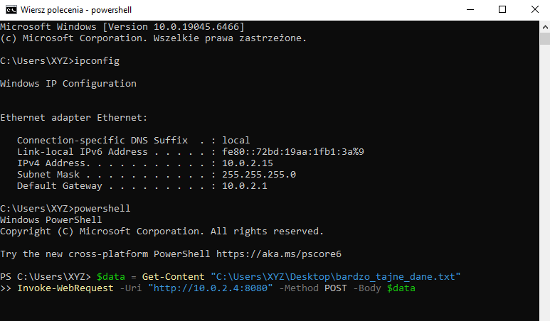
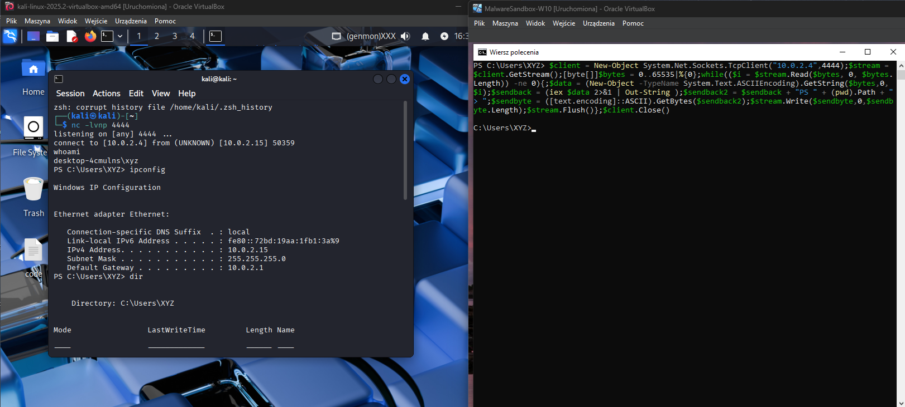
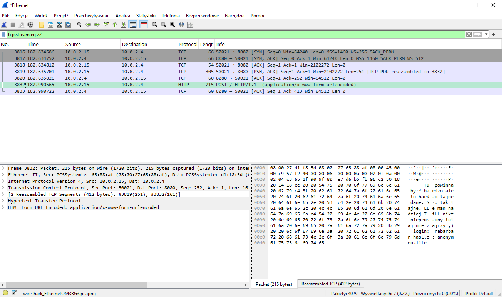
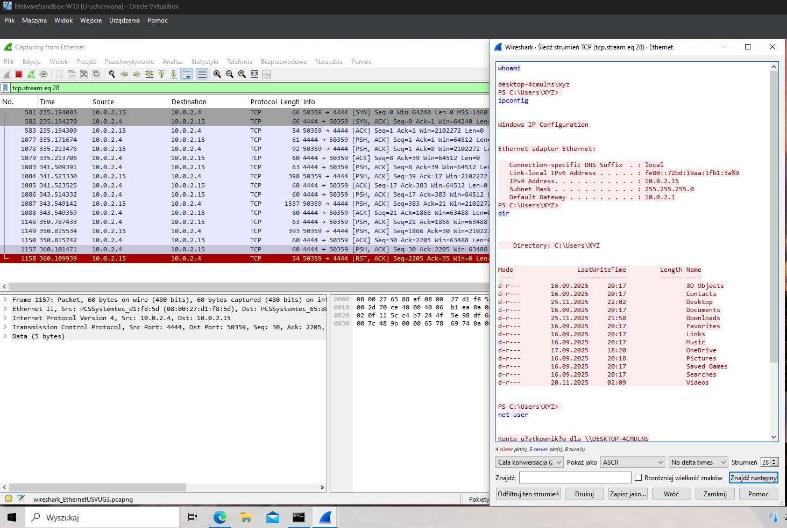
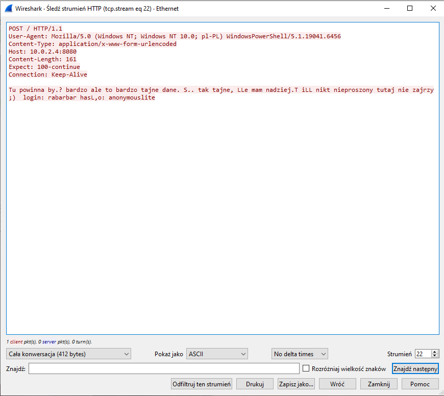
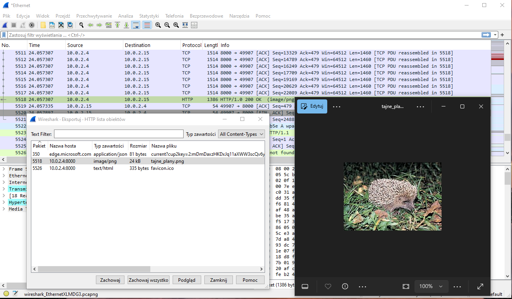
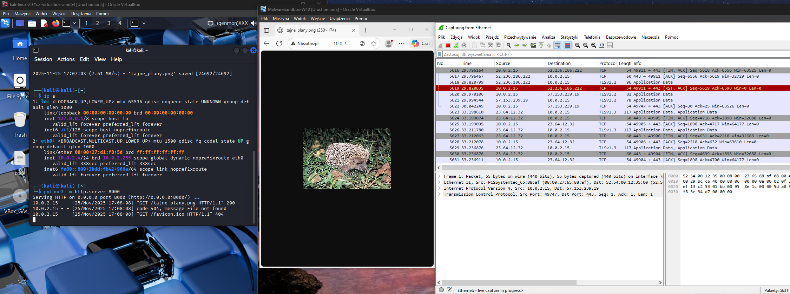

# Network-Forensics-Traffic-Analysis

## 🎯 Cel Projektu
Celem projektu było przeprowadzenie symulacji zaawansowanego incydentu bezpieczeństwa obejmującego **wyciek danych (Data Exfiltration)** oraz przejęcie kontroli nad stacją roboczą poprzez kanał **Command & Control (C2)**.

Moim zadaniem było przechwycenie ruchu sieciowego, wyizolowanie złośliwej komunikacji z szumu tła oraz rekonstrukcja zdarzeń przy użyciu analizy pakietów (PCAP).

## 🛠️ Środowisko i Narzędzia
* **Wireshark:** Główny sniffer i analizator protokołów sieciowych (Deep Packet Inspection).
* **Kali Linux:** Stacja atakującego, pełniąca rolę serwera C2 (nasłuch Netcat, serwer Python HTTP).
* **Windows 10:** Stacja ofiary ("Victim Machine").
* **PowerShell:** Wykorzystany do wykonania bezplikowego ataku (Fileless malware simulation).

---

## ⚡ Faza 1: Scenariusz Ataku (Red Teaming)

W tej fazie wcieliłem się w rolę atakującego, aby wygenerować realne artefakty sieciowe do późniejszej analizy.

### 1. Przygotowanie Infrastruktury Ataku
Na stacji Kali Linux uruchomiłem nasłuch (Listener) przy użyciu narzędzia Netcat, symulując serwer oczekujący na połączenie od zainfekowanej maszyny.

### 2. Wykonanie Payloadu (Reverse Shell & Exfiltration)
Na stacji Windows 10 został uruchomiony złośliwy skrypt PowerShell. Skrypt ten miał dwa zadania:
1.  Przesłać zawartość pliku z hasłami na serwer atakującego (Eksfiltracja HTTP POST).
2.  Nawiązać stabilne połączenie zwrotne (Reverse Shell), dając atakującemu pełną kontrolę nad konsolą systemową.

*Skutek:* Atakujący uzyskał zdalny dostęp do powłoki systemu Windows.

---

## 🔍 Faza 2: Analiza Śledcza (Blue Team / Forensics)

Po przechwyceniu ruchu (Packet Capture), przystąpiłem do analizy pliku `.pcap` w celu znalezienia dowodów włamania (IoC - Indicators of Compromise).

### Krok 1: Redukcja Szumu i Filtrowanie
Ruch sieciowy zawiera tysiące pakietów tła. Aby zidentyfikować anomalię, zastosowałem filtrację opartą na portach niestandardowych (w tym przypadku port nasłuchu C2).

`tcp.port == 8080 || tcp.port == 4444`

Pozwoliło to na natychmiastowe wyizolowanie podejrzanej komunikacji wychodzącej.

### Krok 2: Rekonstrukcja Sesji (TCP Stream)
Pojedyncze pakiety nie dają pełnego obrazu. Użyłem funkcji **"Follow TCP Stream"**, aby złożyć pakiety w czytelną rozmowę klient-serwer.

**Odkrycie 1: Kradzież Haseł**
Analiza strumienia ujawniła, że dane były przesyłane otwartym tekstem (brak szyfrowania TLS). Udało się odczytać zawartość wykradzionego pliku `tajne_hasla.txt`.

### Krok 3: Analiza Protokołu HTTP
Weryfikacja nagłówków HTTP pozwoliła zidentyfikować metodę przesyłu danych (`POST`) oraz cel (adres IP atakującego).

---

## 🧩 Faza 3: File Carving (Odzyskiwanie Artefaktów)

Analiza wykazała również transfer plików binarnych (grafik). W celu sprawdzenia, co dokładnie zostało pobrane przez ofiarę, zastosowałem technikę **File Carving**.

Używając funkcji `Export Objects -> HTTP` w Wiresharku, wyodrębniłem pliki bezpośrednio z przechwyconych pakietów, bez konieczności dostępu do dysku ofiary.

**Proces ekstrakcji obiektu:**

**Odzyskany dowód (Grafika):**
Potwierdzono, że użytkownik (lub skrypt) pobrał z serwera atakującego plik graficzny.

---

## 🚀 Wnioski i Rekomendacje
Analiza wykazała krytyczne błędy w zabezpieczeniach stacji roboczej i sieci:
1.  **Brak szyfrowania:** Dane wrażliwe zostały przesłane otwartym tekstem, co umożliwiło ich łatwe przechwycenie.
2.  **Brak segmentacji/Firewalla:** Ruch wychodzący na niestandardowych portach (4444, 8080) nie został zablokowany.
3.  **Detekcja:** Brak systemu IDS/IPS pozwolił na nawiązanie długotrwałej sesji C2.
